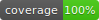

## Ожидаемые входные данные

XML файл со списком продуктов со следующими полями:

- name
- description/description_common/description_for_ozon/description_for_ozon (берется самое первое, либо единственное описание)
- weight (в формате 'n kg'/'n gr'. Хранится в виде граммов, конвертируется при загрузке)
- title (строка, при сохранении проверяется на дубли. Хранятся только уникальные категории)

Лимит на загрузку файла - 800МБ. В идеале, не стоит загружать несколько файлов подряд, но это ограничение зависит лишь от вашего интернет-соединения.

## Ожидаемая работа клиента
1. Три основных страницы - [/products](http://62.84.113.142:8041/products), /add, /statistics. Также пристсвует страница с отображением результатов покрытия тестами: [/coverage](http://62.84.113.142:8042/coverage)
2. /products - экран просмотра товаров с пагинацией и фильтрацией, имеет обновление по таймеру
3. /add - экран добавления новых товаров посредством отправки формы с загруженным .xml файлом. Имеется валидация на тип файла на фронте
4. /statistics - экран просмотра статистики о всех загруженных продуктах с возможностью скачат отчет в формате .xml

## Ожидаемая работа сервера
1. После загрузки файл копируется в локальное хранилище. При этом, если быо загружен не XML-файл, срабоатет валидация
2. Чтение файла происходит асинхронно после записи на сервер. После чтение каждой строки создется отдельная задача, попадающая в очередь. При этом пока файл читается, ручка /api/upload-tasks-count отдает количество непрочитанных до конца файлов.
3. После полного прчтения файл удаляется, начинают отрабатывать задачи на добавление новых товаров.
4. При просмотре списка есть фильтрация по категории, поиск (регистро-зависимый) по названию и описанию, пагинация.
5. Ручка /api/products/statistics/download отдает сгенерированный отчет в формате .csv с информацией обо всех загруженных позициях, не только о последей. Эти данные также отдает ручка /api/products/statistics в формате JSON

## Тонкие места
1. Сортировка на данный момент только на клиенте
2. Обновление списка товаров и оставшихся в очереди файлов происходит раз в 30 секунд. Обновление экрана статистики - раз в минуту.
3. Загрузка файла сильно зависит от скорости интернета клиента
4. В системе нет авторизации
5. Тесты покрывают только API

## Запуск проекта

1. make build 
2. make migrate
3. make test && make test-xml && make badge

Дополнительно: [ссылка](https://github.com/penoplavaaan/kt_test_front) на репозиторий с фронтом